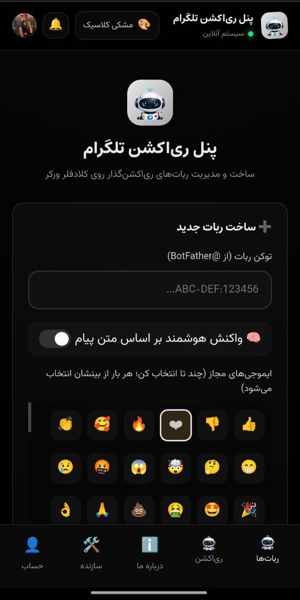

<p align="center">
  
</p>

<h1 align="center">⚡ پنل مدیریت ری‌اکشن تلگرام</h1>
<p align="center"><b>دیپلوی خودکار ربات‌های ری‌اکشن تلگرام روی Cloudflare Workers</b></p>

<p align="center">
  <a href="README.md"></a>
  <a href="README.fa.md"></a>
</p>

<p align="center">
  
  
  
  
  <a href="#-لایسنس"></a>
</p>

---

<p align="center">
  
</p>

---

## 🎯 پنل مدیریت ری‌اکشن تلگرام چیست؟

این پروژه یک داشبورد برای اجرای ربات‌های تلگرامی است که فقط یک کار دارند: ری‌اکشن‌زدن روی
پست‌ها — همان ❤️ 🔥 🎉 که زیر پست‌های کانال می‌بینید. یک توکن از BotFather وارد کنید،
مجموعه‌ای از ایموجی‌ها را انتخاب کنید، و پنل خودش وبهوک را ثبت می‌کند، آپدیت‌های تلگرام را
دریافت می‌کند و به‌محض رسیدن پست جدید، ری‌اکشن می‌زند.

کل اپلیکیشن — روتینگ، رندر HTML، مدیریت سشن، فراخوانی API تلگرام، همه‌چیز — در **یک فایل
جاوااسکریپت** جمع شده که به‌عنوان یک Cloudflare Worker اجرا می‌شود. داده‌ها در Cloudflare
D1 نگهداری می‌شوند و ساختار جدول‌ها همان اولین باری که Worker اجرا می‌شود به‌طور خودکار
ساخته می‌شود. هیچ مرحله‌ی بیلد و هیچ migration دستی‌ای در کار نیست — یک فایل آپلود
می‌کنید، یک دیتابیس وصل می‌کنید، و پنل بالا می‌آید.

---

## ✨ امکانات

| ویژگی | توضیح |
|---|---|
| 🤖 تعداد نامحدود ربات | به تعداد توکن‌هایی که از BotFather دارید، هرکدام با مجموعه ایموجی و پیام `/start` مستقل |
| 🔗 ثبت خودکار وبهوک | افزودن ربات به‌طور خودکار `setWebhook` تلگرام را صدا می‌زند، با secret token اختصاصی |
| 🎯 ری‌اکشن دستی روی لینک | واکنش به یک یا چند لینک `t.me/...` با تا ۴۰ ربات هم‌زمان، ایموجی تصادفی یا ثابت، تأخیر قابل‌تنظیم |
| 🧠 حالت ری‌اکشن هوشمند | انتخاب ایموجی بر اساس حس‌وحال متن پیام، به‌جای انتخاب تصادفی |
| 📥 ایمپورت گروهی | وارد کردن دسته‌ای ربات از یک فایل ساده با فرمت `token,emoji1|emoji2,welcome` |
| 🔁 تلاش مجدد روی خطا | فقط موارد ناموفق را دوباره امتحان کنید، بدون تکرار کل دسته |
| 📊 تاریخچه و آمار روزانه | هر ری‌اکشن دستی ثبت می‌شود؛ هر ربات یک شمارنده و نمودار ۷ روزه دارد |
| 👤 سیستم حساب کاربری | آواتار سفارشی، تغییر رمز، مدیریت چند نشست، ترجیحات اعلان |
| 🎨 پنج پوسته | تیره، روشن، کلاسیک، شیشه‌ای و سایبرپانک — مخصوص هر دستگاه |
| ⚡ بدون زیرساخت جداگانه | کاملاً روی Workers + D1، سازگار با پلن رایگان |

---

## 📦 چه چیزهایی ساخته می‌شود

وقتی پنل را دیپلوی می‌کنید، منابع زیر داخل حساب کلادفلر خودتان ساخته می‌شوند:

| منبع | کاربرد |
|---|---|
| ⚙️ Cloudflare Worker | کل پنل — روتینگ، داشبورد، فراخوانی‌های API تلگرام |
| 🗄️ دیتابیس D1 | نگهداری کاربران، ربات‌ها، تاریخچه ری‌اکشن‌ها، نشست‌ها و اعلان‌ها |
| 🔗 بایندینگ D1 | اتصال دیتابیس به Worker با نام `DB` |
| 🌐 آدرس workers.dev | آدرس عمومی شما برای ورود و دریافت وبهوک‌های تلگرام |
| 🪝 وبهوک هر ربات | `POST /webhook/<id>`، به‌طور خودکار برای هر رباتی که اضافه می‌کنید ثبت می‌شود |

---

## 📋 پیش‌نیازها

| مورد | توضیح |
|---|---|
| حساب Cloudflare | پلن رایگان کافی‌ست |
| دیتابیس Cloudflare D1 | یک‌بار پیش از دیپلوی ساخته می‌شود |
| یک یا چند توکن ربات تلگرام | از [@BotFather](https://t.me/BotFather) |
| مرورگر کروم یا... | برای استفاده از داشبورد |
| Node.js نسخه ۱۸ به بالا و npm | فقط برای روش Wrangler  |

هیچ API key یا سرویس بیرونی دیگری لازم نیست — کلید امضای سشن همان اولین باری که Worker
اجرا می‌شود به‌طور خودکار ساخته و در همان دیتابیس D1 شما ذخیره می‌شود.

---

## 🚀 شروع سریع

دو روش برای دیپلوی، هرکدام از صفر تا صد در ادامه توضیح داده شده: **روش اول** فقط از
داشبورد کلادفلر در مرورگر استفاده می‌کند — بدون نیاز به ترمینال. **روش دوم** از Wrangler استفاده می‌کند، برای کسانی که می‌خواهند از این به بعد دیپلوی فقط یک دستور باشد.

### 🖱️ روش اول — داشبورد کلادفلر (دستی، پیشنهادی برای مبتدی‌ها)

#### مرحله ۱ — ساخت حساب کلادفلر

۱. به [dash.cloudflare.com/sign-up](https://dash.cloudflare.com/sign-up) بروید.

۲. ایمیل و یک رمز عبور وارد کنید.

۳. ایمیل خود را از طریق لینک تأییدیه تأیید کنید.

۴. وارد [dash.cloudflare.com](https://dash.cloudflare.com) شوید.

> 💡 **نکته:** برای Workers و D1 در پلن رایگان نیازی به دامنه، پلن پولی یا اطلاعات
> پرداخت نیست.


#### مرحله ۲ — ساخت دیتابیس D1

۱. در منوی کناری روی **Storage & Databases** کلیک کنید.

۲. تب **D1** را باز کنید.
۳. روی **Create database** کلیک کنید.

۴. نامی مثل `reaction-db` بگذارید و **Create** بزنید.

۵. صفحه‌ی دیتابیس را باز نگه دارید — کمی بعد آن را به Worker وصل می‌کنیم.

نیازی به ساخت جدول نیست. Worker ساختار موردنیازش را همان اولین اجرا خودش می‌سازد.

#### مرحله ۳ — ساخت Worker

۱. در منوی کناری روی **Compute** بزنید و وارد تب **Workers & Pages** شوید.

۲. **Create application** را انتخاب کنید و بعد بین گزینه ها روی **Start whit Hello World!** کلیک کنید.

۳. یک نام انتخاب کنید ( میتونید نام انتخاب شده استفاده کنید ) بعد روی **Deploy** میزنید.


#### مرحله ۴ — آپلود `worke.js`

۱. در صفحه تأیید، روی **Edit code** کلیک کنید تا ویرایشگر کلودفلر باز شود.

۲. تمام کد موجود را انتخاب کرده و حذف کنید.

۳. در مخزن پروژه، فایل **worker.js** را باز کنید.

۴. روی **Raw** کلیک کنید، سپس تمام محتوا را انتخاب و کپی کنید.

۵. کد کپی‌شده را در ویرایشگر**Cloudflare** پیست کنید( می‌توانید فایل **worker.js** موجود در کلودفلر رو حذف و فایل موجود در مخزن رو دانلود و آپلود کنید).

۶. روی **Save and Deploy** کلیک کنید.

> ⚠️ حالا باید دیتابیس **D1** رو به **worker** متصل کنیم.

#### مرحله ۵ — اتصال دیتابیس D1 به Worker

۱. از بخش **Workers & Pages** روی **Worker** خود (همان ورکری که ساختید) کلیک کنید.

۲. به تب **Settings** بروید.

۳. به بخش **Bindings** اسکرول کنید و روی **Add binding** کلیک کنید.

۳. نوع **binding** را **D1 database** انتخاب کنید.

۴. دو فیلد را پر کنید:
**Variable name:** **DB** ← این مقدار باید دقیقا همین باشد
**D1 Database:** دیتابیسی که در گام ۱ ساختید را انتخاب کنید
روی **Save** کلیک کنید.

۴. به صفحه اصلی **Worker** برگردید و روی **Deploy** کلیک کنید.


> 🔔 **نکته:** ربات‌ها، secret وبهوک‌ها — خودکار ساخته و داخل D1 ذخیره می‌شوند.

#### مرحله ۷ — باز کردن پنل و راه‌اندازی اولیه

۱. آدرس Worker را در مرورگر باز کنید.

۲. چون هنوز کاربری نیست، به‌طور خودکار به `/setup` می‌روید.

۳. یک نام کاربری و رمز عبور (حداقل ۶ کاراکتر) برای حساب مدیر انتخاب کنید.

۴. فرم را ثبت کنید — حساب ساخته می‌شود، وارد می‌شوید و داشبورد باز می‌شود.

> 💡 **نکته:** اولین حساب ساخته‌شده از طریق `/setup` حساب مدیر است. بعد از آن `/setup`
> به `/login` ریدایرکت می‌کند، پس رمز عبور را جایی امن نگه دارید.

#### مرحله ۸ — افزودن اولین ربات

۱. در داشبورد، از فرم **افزودن ربات** استفاده کنید و توکنی از
   [@BotFather](https://t.me/BotFather) وارد کنید.
   
۲. ایموجی‌های مجاز و در صورت تمایل یک پیام `/start` سفارشی انتخاب کنید.

۳. ارسال کنید — پنل توکن را تأیید می‌کند، وبهوک را خودکار ثبت می‌کند و ربات فعال
   می‌شود.


---

### 💻 روش دوم — Wrangler CLI

⚠️ نکته: اول در مرورگر خود وارد داشبورد و اکانت کلودفلر خود شوید بعد مراحل رو آغاز کنید.

#### مرحله ۱ — نصب Node.js

Wrangler به Node.js نسخه‌ی ۱۸ یا بالاتر نیاز دارد.

۱. یک نسخه‌ی LTS از [nodejs.org](https://nodejs.org/) دانلود کنید.

۲. نصب را تأیید کنید:

دستور زیر رو در CMD (ترمینال) وارد کنید تا مطمئن بشیم nodejs نصب شده 
```bash
node -v
```
باید چیزی مثل `v18.x.x` یا بالاتر ببینید. اگر خطا دیدید، Node را دوباره نصب کنید.

#### مرحله ۲ — قرار دادن پروژه روی سیستم

```bash
cd reaction-bot
```
اگر فقط فایل‌های اصلی را دارید، `worker.js`، `wrangler.toml` و `package.json` را در یک
پوشه کنار هم بگذارید و به همان شکل وارد آن شوید.

#### مرحله ۳ — نصب Wrangler

Wrangler را با استفاده از دستور زیر در CMD یا ترمینال خود نصب کنید.

```bash
npm install wrangler
```

این دستور Wrangler را داخل `node_modules` نصب می‌کند — وابستگی اجرایی دیگری وجود ندارد،
چون همه‌چیز روی APIهای داخلی Workers اجرا می‌شود.

#### مرحله ۴ — ورود به حساب کلادفلر

```bash
wrangler login
```

این دستور یک پنجره‌ی مرورگر باز می‌کند تا Wrangler را برای حساب کلادفلرتان تأیید کنید.

#### مرحله ۵ — ساخت دیتابیس D1

```bash
wrangler d1 create reaction-bot-db
```

Wrangler یک بلوک خروجی با `database_id` چاپ می‌کند. آن را کپی کنید.

#### مرحله ۶ — به‌روزرسانی `wrangler.toml`
این فایل رو با ویرایشگر مثل vscode یا Notepad باز کنید

```toml
name = "reaction-bot"
main = "worker.js"
compatibility_date = "2024-09-23"

[[d1_databases]]
binding = "DB"
database_name = "reaction-bot-db"
database_id = "REPLACE_WITH_YOUR_DATABASE_ID"
```

مقدار `REPLACE_WITH_YOUR_DATABASE_ID` را با شناسه‌ی مرحله‌ی ۵ جایگزین کنید.
`binding = "DB"` را دقیقاً همان‌طور نگه دارید.


#### مرحله ۷ — دیپلوی Worker

```bash
wrangler deploy
```

Wrangler فایل را آپلود می‌کند، بایندینگ D1 را وصل می‌کند و Worker را منتشر می‌کند و
آدرسی شبیه این چاپ می‌کند:

```
https://tg-reaction-bot.your-subdomain.workers.dev
```


#### مرحله ۹ — باز کردن پنل دیپلوی‌شده

آدرس مرحله‌ی ۷ را باز کنید. مثل روش اول، به‌طور خودکار به `/setup` می‌روید — حساب مدیر
را همان‌جا بسازید.

**همین — از یک ترمینال خالی تا یک پنل کاملاً فعال.**

---

## ⚙️ پیکربندی

| تنظیم | محل نگهداری | چگونه تنظیم می‌شود |
|---|---|---|
| اتصال دیتابیس | بایندینگ `DB` | یک‌بار، هنگام دیپلوی |
| کلید امضای سشن | جدول `app_config` | خودکار در اولین اجرا |
| نام کاربری/رمز مدیر | جدول `users` | توسط شما هنگام `/setup` |
| توکن ربات‌ها، ایموجی‌ها، پیام خوش‌آمدگویی | جدول `bots` | توسط شما از داشبورد |
| پوسته‌ی انتخابی | حافظه‌ی مرورگر | از سوییچ پوسته در هدر |

## 🔑 متغیرهای محیطی

هیچ متغیر محیطی لازم نیست. تنها چیزی که باید تنظیم کنید بایندینگ `DB` است — از نظر فنی
«متغیر محیطی» به‌معنای اصطلاح Workers نیست، اما تنها بخش پیکربندی است که اپ بدونش کار
نمی‌کند.

## 🗄️ دیتابیس

در اولین درخواست به یک دیتابیس جدید، Worker دستورهای `CREATE TABLE IF NOT EXISTS` زیر
را اجرا می‌کند:

| جدول | کاربرد |
|---|---|
| `users` | حساب‌ها، هش رمز، آواتار، ترجیحات اعلان |
| `bots` | ربات‌های ثبت‌شده، توکن‌ها، مجموعه ایموجی، وضعیت |
| `stats_daily` | شمارنده‌ی روزانه‌ی هر ربات برای نمودارهای داشبورد |
| `link_reactions` | تاریخچه‌ی دسته‌های ری‌اکشن دستی روی لینک |
| `recent_links` | لینک‌های اخیر، برای تکمیل خودکار |
| `sessions` | نشست‌های فعال هر دستگاه |
| `notifications` | اعلان‌های داخل پنل |
| `app_config` | انبار کوچک key/value داخلی (فعلاً کلید سشن) |

چون همه‌ی دستورها `IF NOT EXISTS` هستند، اجرا روی دیتابیس راه‌اندازی‌شده همیشه بی‌خطر
است — چیزی حذف نمی‌شود. همین منطق ستون‌های جدید را هنگام آپدیت کد به دیتابیس‌های قدیمی
اضافه می‌کند، پس آپدیت هیچ‌وقت نیاز به SQL دستی ندارد.

## 🔒 امنیت

- رمزهای عبور با PBKDF2 (SHA-256، ۱۰۰٬۰۰۰ تکرار) و یک salt تصادفی مخصوص هر کاربر هش
  می‌شوند — رمز خام هیچ‌وقت ذخیره نمی‌شود.
- نشست‌ها از توکن امضاشده با HMAC استفاده می‌کنند که فقط در کوکی `HttpOnly`، `Secure` و
  `SameSite=Lax` نگه داشته می‌شود؛ کلید امضا تصادفی ساخته و در D1 نگهداری می‌شود.
- هر ربات یک secret وبهوک تصادفی مخصوص دارد که در هر آپدیت ورودی از طریق هدر
  `X-Telegram-Bot-Api-Secret-Token` بررسی می‌شود — عدم تطابق یعنی رد فوری.
- نشست‌ها را تک‌تک یا همه‌باهم از صفحه‌ی حساب کاربری بررسی و لغو کنید.

> 🔔 **نکته:** توکن ربات‌ها همان‌طور که هستند در دیتابیس D1 شما ذخیره می‌شوند، که فقط
> شما و هرکسی با دسترسی به حساب کلادفلرتان می‌تواند بخواند. با این اطلاعات مثل پسورد
> روت یک سرور رفتار کنید.


## ❓ سوالات متداول

**آیا به پلن پولی کلادفلر نیاز دارم؟**
نه — سهمیه‌ی رایگان Workers و محدودیت ذخیره‌سازی/رکورد D1 معمولاً برای یک راه‌اندازی
شخصی کافی‌ست.

**می‌توانم بیش از یک ربات اجرا کنم؟**
بله، بدون محدودیت سخت، به‌جز سقف ۴۰ ربات در هر دسته‌ی ری‌اکشن دستی روی لینک.

**اگر رمز عبورم را فراموش کنم؟**
فعلاً بازیابی خودکار وجود ندارد — باید مستقیماً از کنسول D1 در داشبورد کلادفلر ریست
کنید، یا با دیتابیس تازه دوباره دیپلوی کنید.

**چند نفر می‌توانند یک پنل را با هم استفاده کنند؟**
چند حساب پشتیبانی می‌شود، اما ربات‌ها، لینک‌ها و تاریخچه مخصوص هر حساب هستند — نمای
مشترک/تیمی وجود ندارد.

**آیا این کار خلاف قوانین تلگرام است؟**
ربات‌های ری‌اکشن فقط از طریق Bot API رسمی تلگرام و با توکن‌هایی که خودتان از BotFather
می‌سازید کار می‌کنند. مسئولیت استفاده مطابق قوانین تلگرام برای ربات‌ها و کانال‌های
خودتان بر عهده‌ی شماست.

## 🛠️ عیب‌یابی

| مشکل | دلیل احتمالی | راه‌حل |
|---|---|---|
| صفحه‌ی خالی یا "Internal Server Error" | `worker.js` کامل کپی نشده، یا بایندینگ `DB` تنظیم نشده | مرحله‌ی ۴ و ۵ (روش اول) یا ۶ (روش دوم) را دوباره چک کنید |
| بازگشت به `/setup` حتی بعد از ساخت حساب | بایندینگ D1 به دیتابیس دیگری اشاره می‌کند | نام/شناسه‌ی دیتابیس در بایندینگ را چک کنید |
| «توکن نامعتبر است» هنگام افزودن ربات | توکن اشتباه، یا ربات در BotFather حذف/بازتولید شده | توکن تازه از `/mybots` بگیرید |
| رباتی که قبلاً کار می‌کرد دیگر واکنش نمی‌زند | خطا در ثبت وبهوک، یا از دست رفتن دسترسی در چت | از **تلاش مجدد وبهوک** استفاده کنید؛ عضویت ربات را چک کنید |
| همه‌ی ری‌اکشن‌های دستی شکست می‌خورند | کانال/گروه عمومی نیست، یا ربات عضو نیست | لینک عمومی استفاده کنید یا ربات را اضافه کنید |
| نشست دائم قطع می‌شود | بایندینگ `DB` عوض شده | دوباره وارد شوید؛ فقط یک دیتابیس بایند باشد |

## 🔄 آپدیت کردن

- **روش داشبورد:** **Edit code** را باز کنید، محتوا را با `worker.js` جدید جایگزین کنید،
  **Save and deploy** بزنید.
- **روش Wrangler:** `worker.js` را جایگزین کنید، سپس دوباره `wrangler deploy` را اجرا
  کنید.

جدول‌ها/ستون‌های جدید در اولین درخواست بعد از دیپلوی به‌طور خودکار ساخته می‌شوند —
ربات‌ها، تاریخچه و حساب‌های قبلی دست‌نخورده می‌مانند.

## 🏷️ نسخه

نسخه‌ی فعلی: **v1.0.0** — اولین انتشار عمومی: مدیریت ربات‌ها، ری‌اکشن دستی روی لینک با
حالت هوشمند، ایمپورت گروهی، مدیریت حساب/نشست، و پنج پوسته.

## 🙏 تشکر و قدردانی

ساخته و نگهداری‌شده توسط **مهدی رشیدی‌زاده**
([@code_watch](https://t.me/code_watch) در تلگرام).

## 📄 لایسنس

منتشرشده تحت لایسنس MIT. برای متن کامل به فایل `LICENSE` مراجعه کنید.
